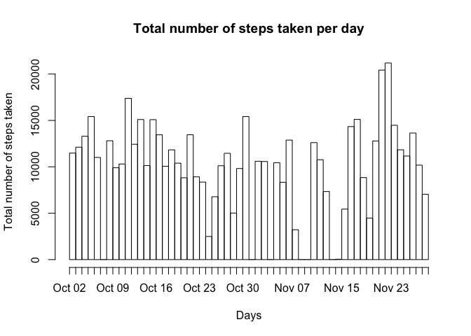
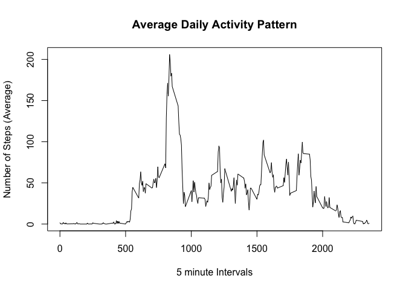
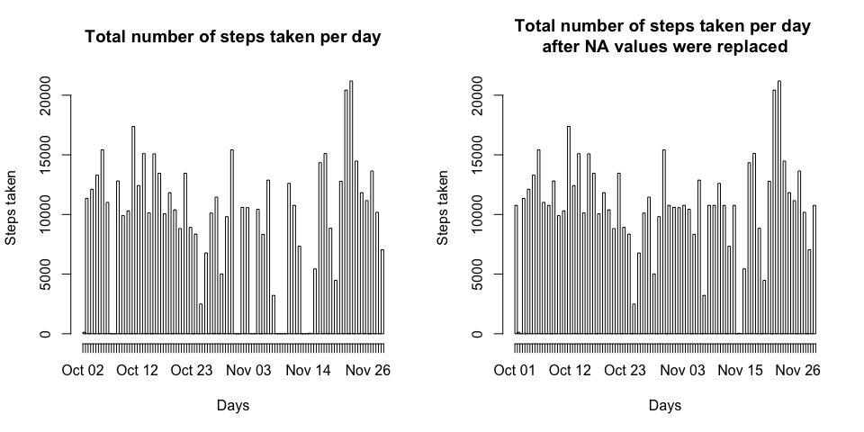
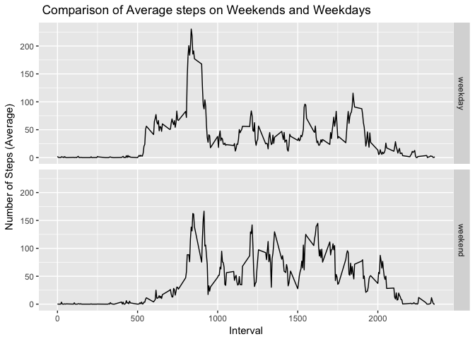

Loading and preprocessing the data
----------------------------------

Let's first load the data and perform some minor transformations.

    library("lubridate")
    library("dplyr")
    fit_dat<- read.csv("activity.csv",header = TRUE, sep = "," )
    fit_dat$date<- ymd(fit_dat$date)

Mean total number of steps taken per day
----------------------------------------

Let's first create a dataframe 'summary' containing the total number of
steps taken per day.

    summary <- aggregate(fit_dat$steps, 
                       by=list(fit_dat$date), 
                       FUN=sum, 
                       na.rm = TRUE)
    colnames(summary)<- c("Date","Total_Steps")

Below is a histogram displaying the total number of steps taken per day.

    hist(rep(summary$Date,summary$Total_Steps), 
         breaks = 61, 
         freq  = TRUE, 
         xlab = "Days",
         ylab = "Total number of steps taken", 
         main = "Total number of steps taken per day")

Calculating the mean and median of the total number of steps taken:

    me<- mean(summary$Total_Steps)
    md<- median(summary$Total_Steps)

The mean and median of the total number of step taken is 9354.2295082
and 10395 respectively.

Average daily activity pattern
------------------------------

Let's create a dataframe 'time'and store the average steps on an
interval basis.

    time<- data.frame(tapply(fit_dat$steps, 
                          fit_dat$interval, 
                          FUN = mean, 
                          na.rm = TRUE))

    time$interval<- rownames(time) %>% as.numeric(time$interval)
    colnames(time)<- c("Average","interval")

Below is the time series plot displaying the the average daily activity
pattern:

    plot(time$interval,time$Average,
         type = "l", 
         xlab = "5 minute Intervals",
         ylab = "Number of Steps (Average)", 
         main = "Average Daily Activity Pattern")

Calculating the 5 minute interval with maximum number of steps:

    int<- time[which.max(time$Average),2]
    a<- int/5

The interval 835 contains the maximum number of steps across all days,
which equals to the 167th 5 minute interval.

Inputing missing values
-----------------------

Calculating the total number of missing values:

    tot<- sum(is.na(fit_dat))

The total number of missing values is 2304

Computing the strategy for filling in the missing values:

    miss <- aggregate(fit_dat$steps, 
                         by=list(fit_dat$date), 
                         FUN= mean, 
                         na.rm = TRUE)
    colnames(miss)<- c("Date","Mean_Steps")
    miss[is.na(miss)] <- 0

Forming a new dataframe without NA values:

    new_fit_dat<- fit_dat
    new_fit_dat$steps <- ifelse(is.na(new_fit_dat$steps) == TRUE, 
                                time$Average[time$interval %in% new_fit_dat$interval], 
                                new_fit_dat$steps)

Plotting and comparing new and old data sets:

    par(mfrow =  c(1,2))

    # old histogram
    summary <- aggregate(fit_dat$steps, 
                         by=list(fit_dat$date), 
                         FUN=sum, 
                         na.rm = TRUE)
    colnames(summary)<- c("Date","Total_Steps")
    hist(rep(summary$Date,summary$Total_Steps), 
         breaks = 90, 
         freq  = TRUE, 
         xlab = "Days",
         ylab = "Steps taken", 
         main = "Total number of steps taken per day")

    # new histogram
    summary_new <- aggregate(new_fit_dat$steps, 
                         by=list(new_fit_dat$date), 
                         FUN=sum, 
                         na.rm = TRUE)
    colnames(summary_new)<- c("Date","Total_Steps")
    hist(rep(summary_new$Date,summary_new$Total_Steps), 
         breaks = 90, 
         freq  = TRUE, 
         xlab = "Days",
         ylab = "Steps taken", 
         main = "Total number of steps taken per day \nafter NA values were replaced")

    n_me<- mean(summary_new$Total_Steps)
    n_md<- median(summary_new$Total_Steps)

The new mean and new median of the total number of step taken is
1.076618910^{4} and 1.076618910^{4} respectively. Both the mean and the
median values have increased. Also, using the strategy of replace the
missing values with the mean of 5 minute intervals have filled up the
plot resulted in a credible and unexaggerated output.

Patterns between weekdays and weekends
--------------------------------------

Creating a new factor variable in the dataset with two levels –
'weekday' and 'weekend'

    new_fit_dat$week <- ifelse(weekdays(new_fit_dat$date) %in% c("Saturday", "Sunday"), 
                               "weekend", 
                               "weekday")
    miss[is.na(miss)] <- 0

Plotting and comparing weekday and weekend data sets:

    library("ggplot2")
    # grouping data on weekend, weekday and interval basis
    group_dat<- group_by(new_fit_dat,interval,week)
    group_dat<- summarise(group_dat, avg = mean(steps))

    # plotting and comparing data
    qplot(interval, avg, data=group_dat,
          geom="line",
          xlab="Interval",
          ylab="Number of Steps (Average)",
          main=" Comparison of Average steps on Weekends and Weekdays",
          facets =week ~ .)

 From
the graphs we understand that the level of activity is a little more
evenly distributed in the case of weekends, where as during weekdays
there is an initial spike followed by a relative drop in activity over
the following intervals.
